# Bestellsystem

Ein modernes Bestellsystem basierend auf SvelteKit, TypeScript und Supabase.

## 📋 Übersicht

Das Ichglaubs Bestellsystem ist eine vollständige Webanwendung zur Verwaltung von Bestellungen. Es bietet Authentifizierung, Dashboard-Funktionalität und eine Admin-Oberfläche.

## 🚀 Features

- **Benutzerauthentifizierung** - Login und Registrierung mit Supabase Auth
- **Dashboard** - Übersichtliche Darstellung von Bestellungen
- **Küche-Ansicht** - Schnelle Bestellverwaltung für die Küche
- **Kasse-Interface** - Intuitive Bedienung an der Kasse
- **Admin-Bereich** - Verwaltungsfunktionen für Administratoren
- **Responsive Design** - Mit TailwindCSS und DaisyUI
- **TypeScript** - Typsichere Entwicklung
- **Realtime Updates** - Dank Supabase

## 📸 Screenshots

### Startseite
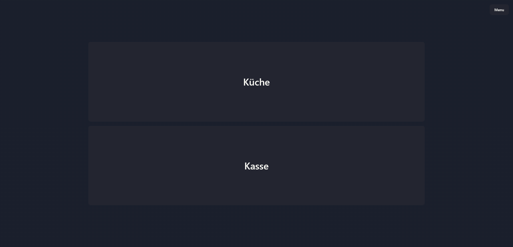

### Küche
Die Küchen-Ansicht zeigt alle Bestellungen in Echtzeit mit einfachen Bedienungselementen.

#### Küche - Bestellübersicht
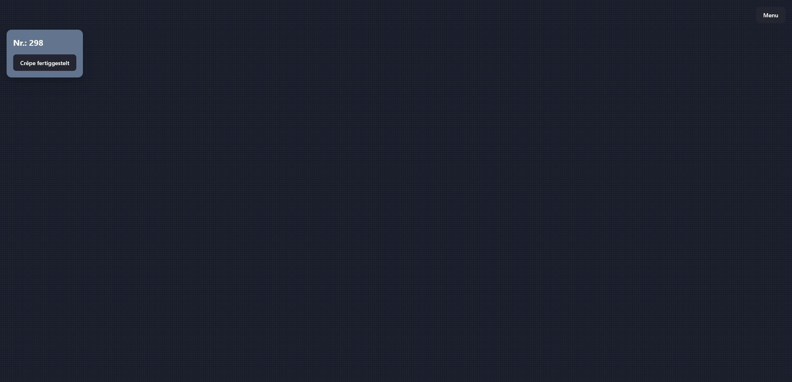
#### Küche - Bestellübersicht - keine Bestellungen
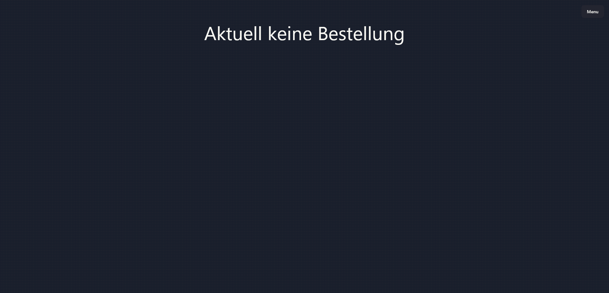
#### Kundendisplay
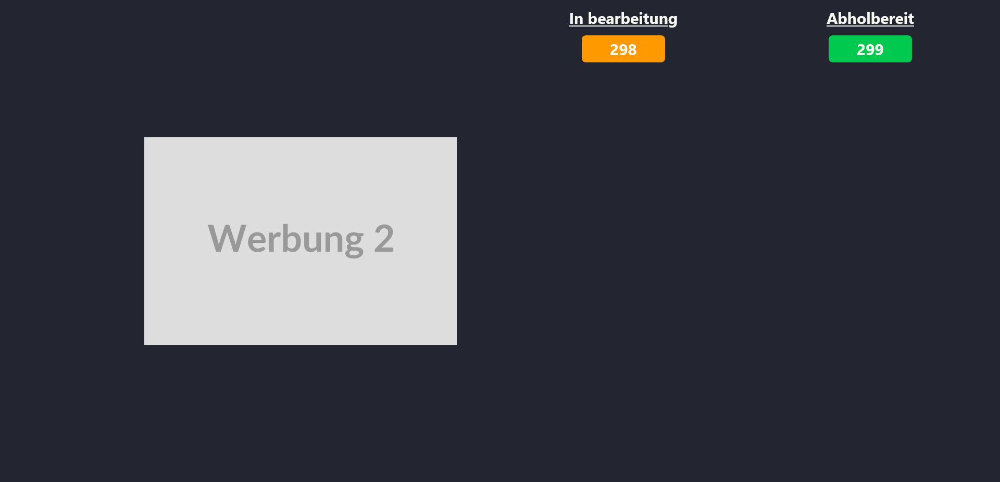
#### Admin - Produkte
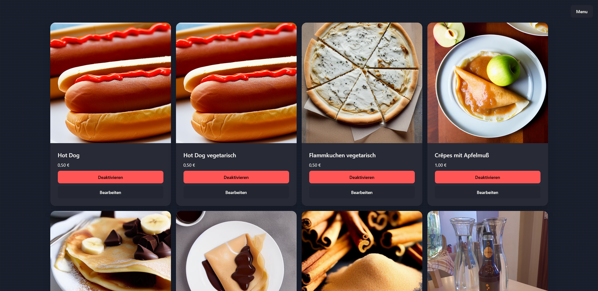
#### Admin - Produkt bearbeiten
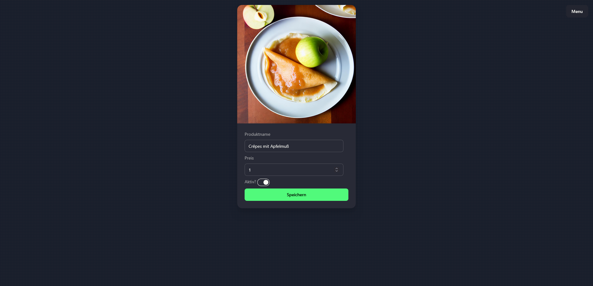
#### Admin - Neues Produkt
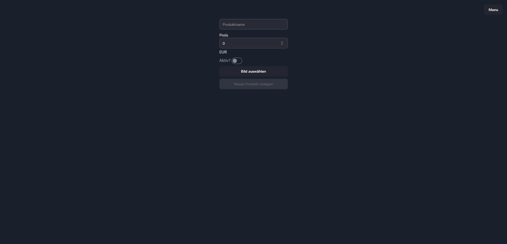
#### Statistiken
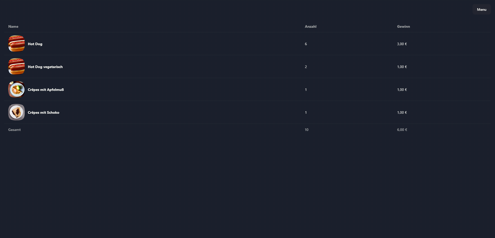
#### Navigationsmenü
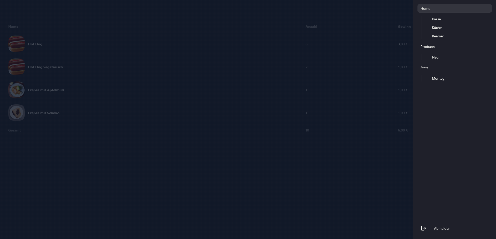

### Kasse
Das Kassen-Interface bietet eine übersichtliche Verwaltung von Bestellungen und Zahlungen.

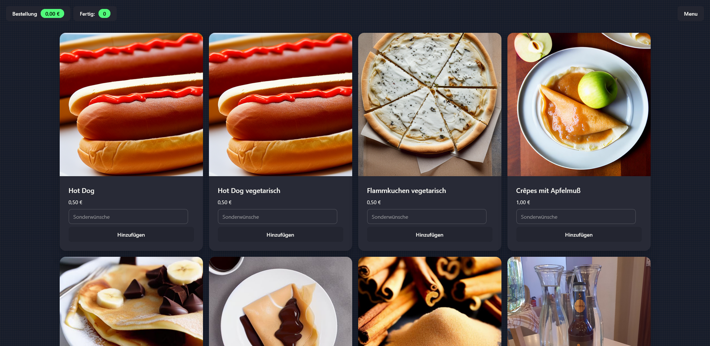
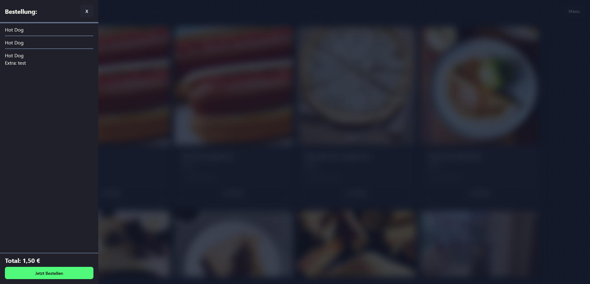
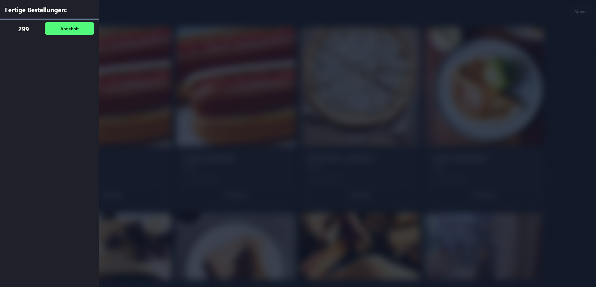

## 🛠️ Tech Stack

- **Framework:** [SvelteKit](https://kit.svelte.dev/)
- **Sprache:** TypeScript
- **Backend/DB:** [Supabase](https://supabase.com/)
- **Styling:**
  - [TailwindCSS](https://tailwindcss.com/)
  - [DaisyUI](https://daisyui.com/)
- **Deployment:** Vercel (Adapter konfiguriert)
- **Notifications:** [Svelte Sonner](https://github.com/wobsoriano/svelte-sonner)
- **Carousel:** Embla Carousel (mit Autoplay)

## 📦 Installation

### Voraussetzungen

- Node.js (empfohlen: siehe `.tool-versions`)
- pnpm (oder npm/yarn)
- Supabase Account und Projekt

### Setup

1. **Repository klonen:**

   ```bash
   git clone <repository-url>
   cd ichglaubs-ordersystem
   ```

2. **Dependencies installieren:**

   ```bash
   pnpm install
   ```

3. **Umgebungsvariablen einrichten:**

   Kopiere `.env.example` zu `.env.local`:

   ```bash
   cp .env.example .env.local
   ```

   Aktualisiere die Variablen in `.env.local`:

   ```env
   PUBLIC_SUPABASE_URL=deine-supabase-url
   PUBLIC_SUPABASE_PUBLISHABLE_KEY=dein-supabase-publishable-key
   ```

4. **Supabase Projekt einrichten:**
   - Erstelle ein neues Projekt in [Supabase](https://app.supabase.com/)
   - Konfiguriere die benötigten Tabellen und Authentifizierung
   - Kopiere die Projekt-URL und den Publishable Key in deine `.env` Datei

## 🏃‍♂️ Entwicklung

### Development Server starten

```bash
pnpm dev
```

Die Anwendung ist dann unter `http://localhost:5173` erreichbar.

### Mit Browser öffnen

```bash
pnpm dev -- --open
```

## 🔨 Build & Deployment

### Production Build erstellen

```bash
pnpm build
```

### Production Build lokal testen

```bash
pnpm preview
```

### Deployment

Das Projekt ist für Vercel konfiguriert (`@sveltejs/adapter-vercel`).

Für Deployment auf Vercel:

1. Repository mit Vercel verbinden
2. Umgebungsvariablen in Vercel setzen
3. Deploy ausführen

## 🧪 Code Quality

### Type-Checking

```bash
pnpm check
```

Mit Watch-Modus:

```bash
pnpm check:watch
```

### Linting

```bash
pnpm lint
```

### Code-Formatierung

Code formatieren:

```bash
pnpm format
```

Formatierung überprüfen:

```bash
prettier --check --plugin-search-dir=. .
```

## 🔐 Authentifizierung

Das Projekt nutzt **Supabase SSR** mit `@supabase/ssr` für sichere serverseitige Authentifizierung. Die Authentifizierung wird über Server-Hooks (`hooks.server.ts`) verwaltet.

### Authentifizierungs-Flow

- Server-seitige Verwaltung von Sessions via Cookies
- JWT-Validierung durch `safeGetSession()`
- Automatische Sitzungsverwaltung in `event.locals`
- Secure Cookie-Handling mit Path-Einstellungen

## 🎨 Styling

Das Projekt verwendet:

- **TailwindCSS** für Utility-First CSS
- **DaisyUI** für vorgefertigte UI-Komponenten

## 📝 Lizenz

Alle Rechte vorbehalten.

## 👨‍💻 Entwicklung

Entwickelt mit ❤️ unter Verwendung von SvelteKit und Supabase.
